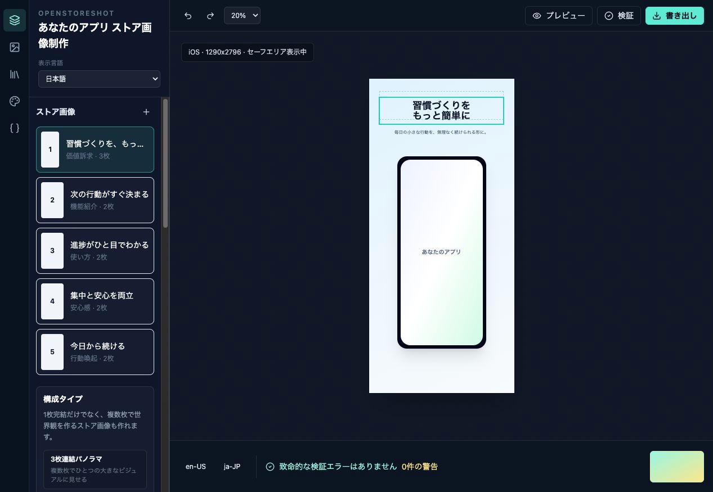
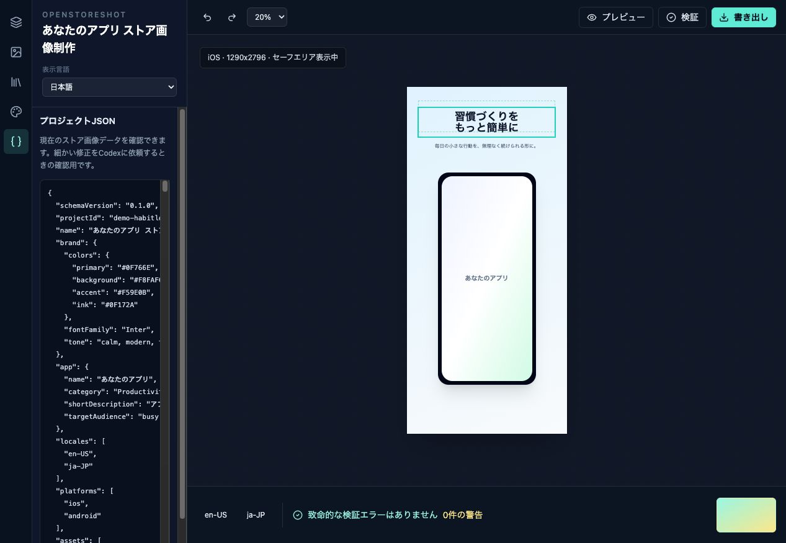

# OpenStoreShot

OpenStoreShot is a local-first OSS studio for designing, reviewing, validating, and exporting App Store and Google Play store images with Codex in the loop.

<p>
  <a href="LICENSE"></a>
  <a href=".github/workflows/ci.yml"></a>
  
  
</p>

<p><b>English</b> · <a href="README.ja-JP.md">日本語</a> · <a href="docs/I18N.md">Localization guide</a></p>



## Why OpenStoreShot

Store screenshots sit between brittle scripts and heavyweight design tools. OpenStoreShot gives indie developers, marketers, and small teams a reproducible workflow:

- Inspect and edit store images in a polished browser studio.
- Ask Codex to revise `storeshot.project.json`, render, validate, and summarize changes.
- Upload real app screenshots and place them inside device mockups.
- Browse App Store / Google Play references as high-level inspiration, without copying competitor creative.
- Export deterministic PNG/JPEG assets for iOS and Android.
- Run locally with fixtures and mock image generation. No browser-exposed API keys.

## Screenshots

| Studio editor | Reference Gallery | Project JSON |
| --- | --- | --- |
|  |  |  |

## Core Features

- **Manual Studio**: slide list, layer panel, canvas preview, inspector, background editing, typography, right-click layer actions, undo/redo, screenshots upload, and export preview.
- **Reference Gallery**: App Store / Google Play adapter interface, fixture mode, live App Store fetching, image proxying, store links, and inspiration-only briefs.
- **Codex Workflow**: a local request queue plus `.agents/skills/storeshot-designer/SKILL.md` so Codex can edit, validate, render, and report.
- **Renderer and Validator**: shared schema, deterministic SVG/Sharp rendering, iOS and Android target checks, Google Play feature graphic warnings.
- **Internationalization**: first UI dictionary layer for Japanese, English, Simplified Chinese, Traditional Chinese, Korean, Spanish, French, German, and Brazilian Portuguese.
- **OSS Foundation**: CI, contribution guide, issue templates, PR checklist, docs, demo project, and copyright policy.

## Quick Start

```bash
pnpm install
pnpm dev
```

Open the URL printed by Next.js, usually `http://127.0.0.1:3000`.

Useful commands:

```bash
pnpm storeshot validate examples/demo-project/storeshot.project.json
pnpm storeshot render examples/demo-project/storeshot.project.json
pnpm storeshot export examples/demo-project/storeshot.project.json --platform ios --locale ja-JP
pnpm storeshot export examples/demo-project/storeshot.project.json --platform android --locale ja-JP
pnpm storeshot ref appstore --country jp --feed top-free --limit 50
pnpm storeshot ref play --country jp --category productivity --limit 50
```

## Codex Workflow

OpenStoreShot itself is not a cloud AI product. The intended loop is:

1. Open the project in the studio.
2. Review the visual output and make small manual edits.
3. Add a Codex request from the UI, or ask Codex directly.
4. Codex edits `storeshot.project.json` and local assets.
5. Codex runs validation/render/export and reports the result.
6. Reopen the studio to inspect the updated images.

OpenStoreShot does not require an image generation API key. Placeholder generation is local and deterministic for demos, tests, and CI. Real asset generation should happen through the local Codex workflow or other local tools chosen by the user.

## Architecture

```text
apps/web                  Next.js Studio UI
packages/core             schema, targets, validation, guardrails
packages/renderer         deterministic PNG/JPEG renderer
packages/store-fetch      App Store / Google Play adapters and fixtures
packages/imagegen         local placeholder provider and prompt guardrails
packages/cli              storeshot CLI
examples/demo-project     fictional demo project and safe assets
docs                      requirements, architecture, specs, policies
.agents/skills            Codex workflow skill
```

`storeshot.project.json` is the durable project format. The studio previews it, the CLI renders it, validators inspect it, and Codex edits it.

## Reference Safety

Reference apps are shown for analysis only. OpenStoreShot should extract high-level patterns such as:

- headline length
- slide role
- device framing
- color mood
- information hierarchy

Do not copy competitor screenshots, logos, UI, characters, proprietary visual treatments, or exact compositions. See [COPYRIGHT_AND_REFERENCE_POLICY.md](docs/COPYRIGHT_AND_REFERENCE_POLICY.md).

## Internationalization

The initial UI language switcher supports:

`ja-JP`, `en`, `zh-CN`, `zh-TW`, `ko`, `es`, `fr`, `de`, `pt-BR`

See [docs/I18N.md](docs/I18N.md) to add or improve translations.

## Development

```bash
pnpm lint
pnpm typecheck
pnpm test
pnpm build
pnpm e2e
```

## Reference OSS

OpenStoreShot learns from these projects without copying their code or assets:

- `ParthJadhav/app-store-screenshots`: Codex-friendly screenshot project workflow.
- `YUZU-Hub/appscreen`: browser editor UX, background/text/device controls, export ergonomics.
- `fastlane/fastlane`: deterministic automation, CI-minded snapshot/frame workflows.
- `facundoolano/google-play-scraper`: replaceable Google Play metadata adapter pattern.
- `nexu-io/open-design`: multilingual OSS docs, agent-driven local design loop, screenshot-heavy README, contributor scaffolding.

See [docs/REFERENCE_OSS_AUDIT.md](docs/REFERENCE_OSS_AUDIT.md).

## Contributing

Read [CONTRIBUTING.md](CONTRIBUTING.md). Good first contribution areas include:

- additional locale dictionaries
- better device frame presets
- Google Play adapter hardening
- more store target validations
- renderer typography fidelity
- accessibility and keyboard editing polish

## License

MIT. See [LICENSE](LICENSE).
